# Datapacks for Minecraft
Various datapacks for Minecraft 1.14

- [Datapacks for Minecraft](#Datapacks-for-Minecraft)
- [List of Crafting Recipe Tweaks](#List-of-Crafting-Recipe-Tweaks)
  - [All Stones Tools](#All-Stones-Tools)
  - [Cheaper Ice](#Cheaper-Ice)
  - [Craftable Bell](#Craftable-Bell)
  - [Shapeless Paper (and Bread!)](#Shapeless-Paper-and-Bread)
- [List of Content Datapacks](#List-of-Content-Datapacks)
  - [Mob Tags](#Mob-Tags)
  - [Personal Endportal](#Personal-Endportal)
  - [Weatherchanger](#Weatherchanger)
- [Datapack Installation](#Datapack-Installation)
- [Remove Datapacks](#Remove-Datapacks)
- [License](#License)

# List of Crafting Recipe Tweaks

## All Stones Tools
Allows the player to craft stone tools out of every stone variant. It is no longer necessary to use cobblestone, additionally these stone blocks can be used as well in any combination: Clean stone, every variant of stone bricks, smooth stone and granite, andesite and diorite as well as their polished variants.

This is a list of the blocks, that can be used in the recipes:<br>
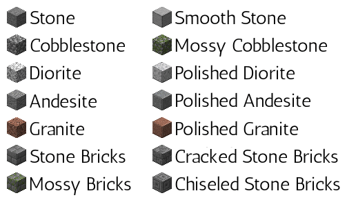

Some examples for the recipes (all combination of the above blocks are possible in the shape all of the tools would be crafted normally):<br>
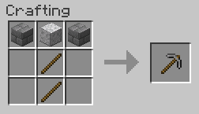
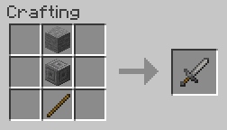

Download [this zip-file](_packs/All_Stones_Tools-V1.zip). Installation instructions can be found [here](#Datapack-Installation).

## Cheaper Ice
The Cheaper Ice datapack changes the recipes of packed ice and blue ice to only require four pieces of ice and packed ice, respectively. It also adds the possibility to uncraft packed ice and blue ice back to ice again.

All four recipes:<br>
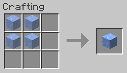
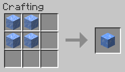
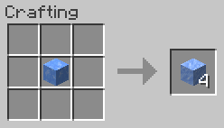
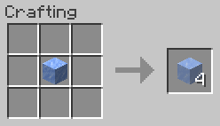

Download [this zip-file](_packs/Cheaper_Ice-V1.zip). Installation instructions can be found [here](#Datapack-Installation).

## Craftable Bell
The beautiful bells found in the villages since MC 1.14 could never be crafted. This is a real shame. But don't worry, this datapack will fix this! Bells can now be crafted.

The crafting recipe looks like this:<br>
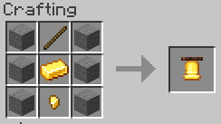

Download [this zip-file](_packs/Craftable_Bell-V1.zip). Installation instructions can be found [here](#Datapack-Installation).

## Shapeless Paper (and Bread!)
Paper and bread get a shapeless recipe, which means they can now be crafted in the small 2*2 crafting grid in the player's inventory.

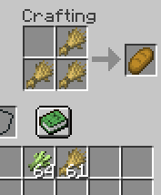
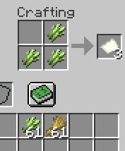

Download [this zip-file](_packs/Shapeless_Paper-V2.zip). Installation instructions can be found [here](#Datapack-Installation).

# List of Content Datapacks

## Mob Tags
> Tags in data packs allow players to group items, blocks, fluids, entity types or functions together using JSON files.<br>
> -- [Minecraft Wiki](https://minecraft.gamepedia.com/index.php?title=Tag&oldid=1416823)

Since the amount of tags given by vanilla Minecraft is very limited, this pack adds various additional tags for mobs. These tags can be called in commands in [target selectors](https://minecraft.gamepedia.com/Commands#Target_selectors) to adress only certain types of mobs.

With this datapack nstalled, it is no longer necessary to adress every mob on its own, instead certan groups can be affected. For example, to effect every zombie variant with the glowing effect, you can now use

```
/effect give @e[type=#mob_tags:zombies] minecraft:glowing 30
```

instead of using the **five** seperate commands

```
/effect give @e[type=minecraft:zombie] minecraft:glowing 30
/effect give @e[type=minecraft:husk] minecraft:glowing 30
/effect give @e[type=minecraft:zombie_villager] minecraft:glowing 30
/effect give @e[type=minecraft:zombie_pigman] minecraft:glowing 30
/effect give @e[type=minecraft:drowned] minecraft:glowing 30
```

Download [this zip-file](_packs/Mob_Tags-V1.zip) to obtain all packs. If you need only a single tag for your pack, choose it from [the unzipped pack](mob_tags/data/mob_tags/tags/entity_types/) and include it in your own namespace. A list of all available tags can be found in the [List-of-Tags file](List-of-Tags.md#Tags).

Installation instructions can be found [here](#Datapack-Installation).

## Personal Endportal
This pack allows players to build their own end portal wherever they want after they have been to the end once and have collected some end stone and purpur blocks for the structure.

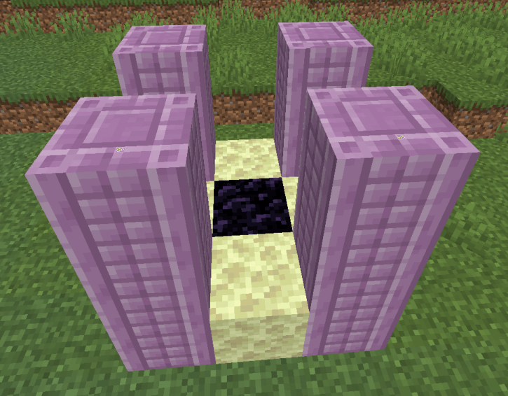

The structure consists out of one obsidiann in the center, four end stone and 12 purpur pillars. The purpur pillars need to be places in the same orientation as shown in the image. The portal can be activated by dropping a stack of 12 eye of ender on the central obsidian block.

Every player can only create one portal. This number can be changed by an OP player.

A portal can be removed again by placing water on the end portal block in the center. This requires shift-clicking on the edge of the portal frames, so the portal cannot be removed by accident.

Download [this zip-file](_packs/Personal_Endportal-V2.zip). Installation instructions can be found [here](#Datapack-Installation).

## Weatherchanger
The player is able to build a structure that changes the weather to a thunderstorm, so it can use the [channeling enchantment](https://minecraft.gamepedia.com/Channeling) on the new fancy trident.

To change the weather, throw a gold block on a two blocks high pillar of obsidian and stand back!

Download [this zip-file](_packs/Weatherchanger-V2.zip). Installation instructions can be found [here](#Datapack-Installation).

# Datapack Installation
Download the .zip-file of the desired datapack and save it in `.minecraft/saves/*your-worldname*/datapacks/` without unzipping it. *your-worldname* is the folder of the Minecraft world the pack should be installed in.

The world folder can be found by selecting the world (not starting it) and clicking on the "Edit" button on the bottom left corner. There simply choose "Open world folder" to open the folder and paste the datapack into the "datapacks" folder. (Create the folder if there is none.)

The datapack should now be enabled when the world gets started.

If cheats are enabled in the Minecraft world, type `/datapack list enabled` into the chat box and press ENTER. It should now display a message that contains `[file/*name-of-the-pack*.zip]`.

# Remove Datapacks
To remove a datapack temporarily, type `/datapack disable *datapack-name*` into the in-game chat. You will be able to reactivate the datapack without losing any information with `/datapack enable *datapack-name*` again.

To permanently remove a datapack run `/function *datapack-name*:uninstall`. This will remove the data created by the datapacks. For example, the data for the weatherchanger datapack can be removed with `/function weatherchanger:uninstall`. Then simply remove the .zip-file from the worlds datapack folder at `.minecraft/saves/*your-worldname*/datapacks/`.

# License
You don't have to credit me to use these packs. However, it would be nice to leave a notice if you are using one of the [Content Datapacks](#List-of-Content-Datapacks) on a public server or a map you make publicly available for download.

You are free to redistribute and modify these datapacks.

Please make sure that you use the pack in accordance with the [Minecraft EULA](https://account.mojang.com/documents/minecraft_eula)!
